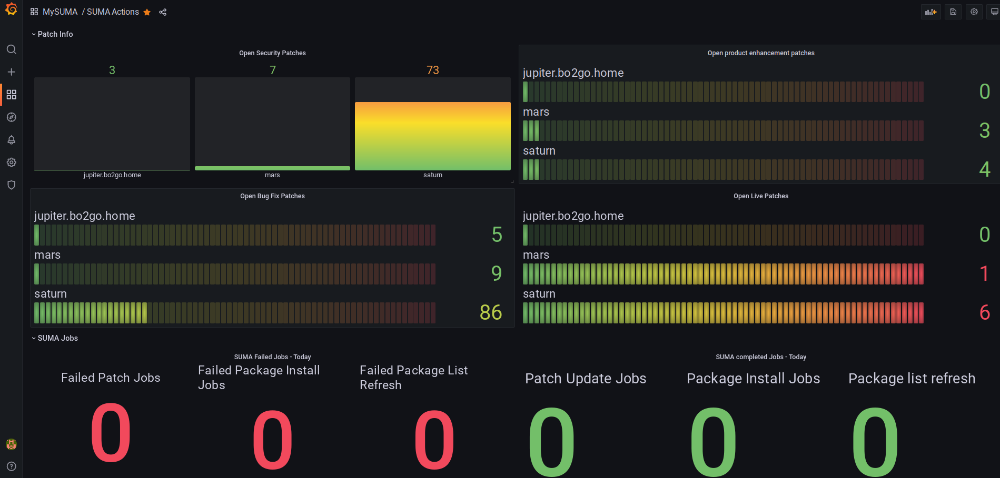

# sumaprom - is a simple SUSE Manager / Uyuni prometheus exporter

This exporter is written in go using xmlrpc api of Uyuni system.
The exporter can run on a different host then Uyuni system. It uses Uyuni https api that is xmlrpc.

The original requirement is to query some information e.g. number of live patches per host and  if any patch jobs failed and send alert through prometheus alertmanager.

Although the newest SUSE Manager / Uyuni already provides http rest api but xmlrpc api is performing better and fast.

The API  credentials will be provded through a configuration file in which the server, userid and password are stored. 
To make the password not stored as plain text in config file the program also provides a parameter to generate a encrypted and base64 hashed string. This hash string will be decrypted when the program starts to run.

At the moment the program is __listening on port 8888__



suse manager prometheus exporter

## Download source code:
```
git clone https://github.com/bjin01/sumaprom.git
```
## Generate sumaconfig:
```
go run main.go -create-sumaconf suma.conf
```
## Optional: use your own keystring for password encryption:
Generate a 32 bytes keystring on linux:
```
head -c16 </dev/urandom|xxd -p -u
```
Set the OS environment variable:
```
export SUMAPROM_ENCRYPT=`head -c16 </dev/urandom|xxd -p -u`
```
Or use one-liner command:
```
export SUMAPROM_ENCRYPT=`head -c16 </dev/urandom|xxd -p -u`
```


## Run in source code mode (go v1.19 required):
```
go run main.go -sumaconf suma.conf
```

## Prometheus configuration needed:
/etc/prometheus/prometheus.yml
```
- job_name: mysuma
    scrape_interval: 5m
    scrape_timeout: 20s
    static_configs:
      - targets:
        - 192.168.122.1:8888

```
Don`t forget to reload prometheus.service

